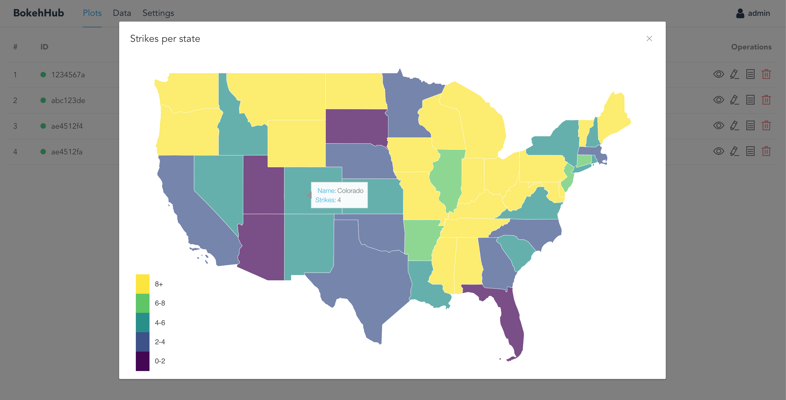

# BokehHub
BokehHub is an application that comes as a self-contained Docker image which can be run on most operating systems. Once it is started, it serves as a central place to create, manage and publish [Bokeh](https://github.com/bokeh/bokeh) visualizations. It comprises a clean user interface for managing visualizations as well as a Python backend which is responsible for the distribution of visualizations to every place where they are required. Data is held centrally and every update to the data or the way it is presented will automatically be visible everywhere. BokehHub also comes with support for dynamic, server-side data preprocessing which enables you to stream data to your audience or to notify them in case of server-side events. Last but not least, BokehHub provides the possibility to embed visualizations in every website without the need for backend modifications.





## Table of Contents

* [Credits](#credits)
* [Motivation](#motivation)
* [Prerequisites](#prerequisites)
* [Setup](#setup)
* [First Steps](#first-steps)
* [Features](#features)
  * [Managing Datasets](#managing-datasets)
  * [Creating Plots](#creating-plots)
  * [Embedding Plots](#embedding-plots)
* [Migration](#migration)
* [To Do](#to-do)

## Credits
I want to thank [Daniel Bias](http://danielbias.de) for his support & inspiration throughout this project!

## Motivation
Visualizing results of scientific research is an important aspect of making publications more accessible to a wider audience. However, common ways of scientific data visualization lack interactivity and do not account for changing or continuously updating data. Moreover, publishing visualizations at more than one place (e.g. multiple websites) leads to redundancy and makes it difficult and time-consuming to maintain.  As a consequence, there is demand for a centralized approach of managing all visualizations at one place. That approach enables researchers to deliver accessible, interactive visualizations which are consistent and redundancy-free.

## Prerequisites
* Docker
* At least 8 GB RAM, more is recommended
* Up-to-date linux distribution is recommended (e.g. Ubuntu 16.04)

## Setup
```sh
# clone repository
git clone https://github.com/alebeck/BokehHub.git

# change to bokehhub directory
cd bokehhub

# fire up docker-compose
docker-compose up -d
```

When starting BokehHub for the first time, this command can take up to 15 minutes. Once BokehHub is running, Docker will monitor the application and take care of restarting it in the event of an error. If you have Docker configured to run on system startup, Docker will also restart BokehHub when the machine is rebooted.

## First Steps
After setup, BokehHub listens on port `80` by default. On the login screen, enter the default admin credentials (username: `admin`, password: `admin`) to be forwarded to your plots section. Then, navigate to the `Settings` tab to set your hostname as well as a new password. The former is mandatory since the BokehHub installation cannot know its public host name or IP address while this information is required for the correct embedding of plots into webpages.

## Features

### Managing Datasets
To upload a new dataset, go to the `Data` tab and click the `Add new` button. In case you want to update an existing dataset, click the `Arrow up` icon next to the relevant dataset. The new dataset will transparently replace the old one. Note that in this case, the old name of the dataset will be kept in order to avoid problems with plots that rely on that name. After the status indicator next to the relevant dataset has switched from yellow (i.e. pending) to green (i.e. ready), the new dataset is used by every plot which was using the old dataset before.

### Creating Plots
You can create a visualization by navigating to the `Plots` tab and clicking `Add New`. A dialog will open which presents a text editor with a boilerplate Bokeh application, ready to be extended:

```python
#! This is the plot's title

# imports (change them as you want)
from bokeh.plotting import figure
from bokeh.models import HoverTool, ColumnDataSource, LinearColorMapper, LogColorMapper, ColorBar
import numpy as np
import pandas as pd

# the path of a dataset can be accessed via datapath['<name of dataset>']
from data import datapath

def make_document(doc):
    # create your plot here and finish this function by calling doc.add_root(<your plot>)
```

You can freely adjust the imports, however keep in mind that new modules which are not installed on the system have to be added to `requirements.txt` in the BokehHub root directory, followed by a rebuild of the Docker image. 

The path to a dataset which was added beforehand can be retrieved via `datapath[name]` where `name` is the name of the dataset, including file extension. To give an example, the following code would load the content of the `strikes.dta` file into a pandas dataframe:

```python
df = pd.read_stata(datapath['strikes.dta'])
```

In order to create a Bokeh visualization, all code has to be written to the `make_document` function. Before returning, the created Bokeh figure (or grid etc.) has to be added to the root document by calling 

```python
doc.add_root(p)
```

provided that `p` is a valid Bokeh figure. For further reference on how to create Bokeh visualizations, I recommend consulting the extensive Bokeh user guide (e.g. https://bokeh.pydata.org/en/latest/docs/user_guide/plotting.html). For the definition of complex applications which include server-side logic, a look at https://bokeh.pydata.org/en/latest/docs/user_guide/server.html may be advised.

#### Best Practices
There are a few best practices when creating Bokeh plots which help to improve the visual experience in combination with BokehHub. First of all, you should configure your plot to have no outline:

```python
p.outline_line_color = None
```

Additionally, hiding the Bokeh toolbar is advised in most cases. To do so, just add the relevant argument when creating a new figure:

```python
p = figure(
    toolbar_location = None, 
    # additional arguments
)
```

Finally, it is advised to test your plots first in an environment outside of BokehHub. BokehHub will warn you in case of syntax errors, however, runtime errors will be hard to spot and can be easily avoided when testing the plot beforehand. This is particularly relevant when working with very complex visualizations. As a testing environment, Jupyter Notebook / Lab is recommended.

#### Plot Sizing
Sizing your plot correctly will influence the way it behaves both on BokehHub and on websites where it will be embedded. In general, we have two sizing possibilities for each plot:

* Setting the size explicitly by passing a `width` and/or `height` argument when creating a figure. In most cases, setting only the width is enough since Bokeh tries to keep the aspect ratio of the visualization. When setting the size of the plot this way, it will have the same size on every page where you embed the plot.
* Passing `sizing_mode='stretch_both'` when creating a figure. You can then dynamically set the plot size when embedding it into a web page. Normally, this mode is preferable over the above-mentioned option. However, working with grids in combination with this option is currently not sufficiently supported by Bokeh version 0.12. Therefore, you need to use explicit sizes when working with grids, columns or rows.

### Embedding Plots
To embed a visualization, go to the plot overview and click the `Show Tokens` symbol in the line corresponding to the relevant plot. In the appearing dialog, you can manage your security tokens. In order to create a new token, click `New Token`. In the following dialog, you will be asked to enter a token name for identification purposes. It is recommended to choose the name of the website which you want to embed the plot into, such that when revoking the token, you can easily identify it by that name.

By clicking the embed logo next to an issued token, all relevant information is displayed. This includes a simple `plot` tag which can be inserted in the target page's HTML:

```html
<plot id="<plot ID>" width="970" height="400" key="<token>"></plot>
```

Additionally, the BokehHub client script has to be included into the page:

```html
<script src="http://<BokehHub IP>/js"></script>
```

This script will resolve all `plot` tags on the page and setup the corresponding visualizations.

#### Security Considerations

When embedding a plot into a website, the source code of that website will reveal the token which is used to gain access to the plot. It is therefore advised to revoke the relevant token once a plot is not used any longer.

## Migration
BokehHub creates three subdirectories inside `~/bokehhub`:

* `config`: Contains configuration files which define visualization tokens, login information and general settings
* `plots`: Contains visualizations
* `data`: Contains datasets

In case you want to migrate your BokehHub installation and keep your configuration, plots and data, you will need to copy the `~/bokehhub` directory with the above-mentioned subdirectories.

## To Do

* Multi-user support
* Migrate data storage to MongoDB
